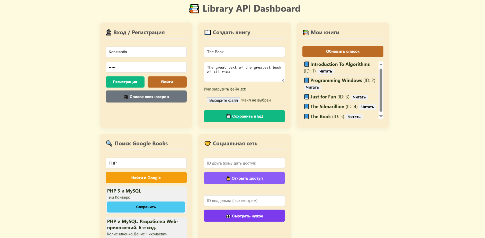
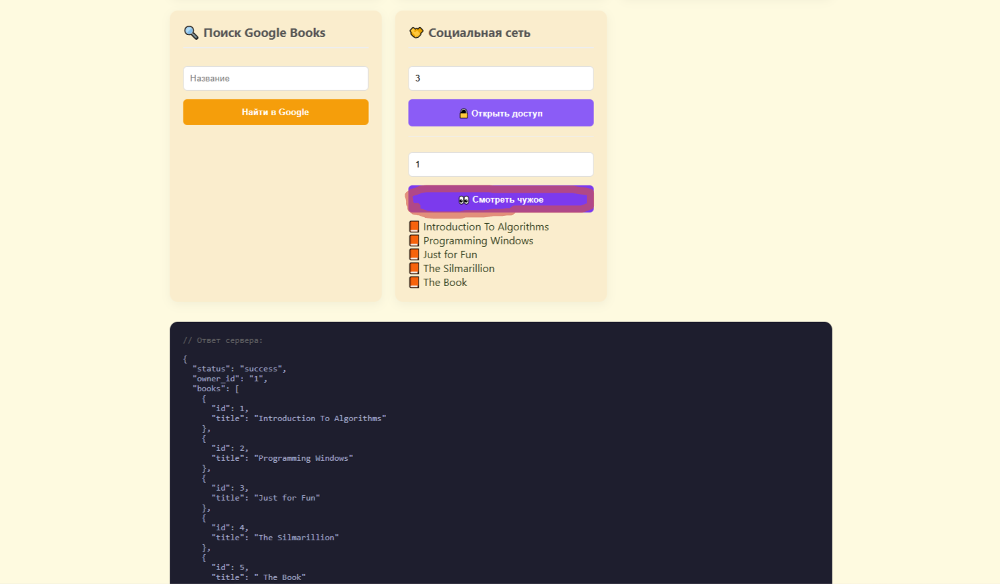

# Library Mobile API

<p align="center">
  
</p>
<p align="center">
  <i>Панель управления API: Тестирование методов, управление книгами и правами доступа.</i>
</p>

## 🚀 О проекте

**Library Mobile API** — это программное решение для мобильного приложения, которое помогает привести в порядок список книг.

В современном мире как никогда полезно надежное хранение информации с возможностью поиска и быстрого доступа. Этот проект направлен на решение этих проблем.

**Что он делает:**
Приложение позволяет создать свою цифровую полку(или даже шкаф): загружать собственные текстовые файлы (`.txt`) или мгновенно добавлять книги из поиска **Google Books**. Кроме того, реализована полезная социальная функция — вы можете открыть доступ к своей библиотеке другу, чтобы он увидел ваши книги.


## 🏗️ Архитектура

Проект построен по принципам **MVC (Model-View-Controller)** без использования тяжелых фреймворков. Логика разделена на слои:

* **Controller (`api.php`)** — Маршрутизация запросов, валидация входных данных, формирование JSON-ответов.
* **Service Layer (`Service.php`)** — Бизнес-логика приложения, интеграции с внешними API, проверка прав доступа (ACL).
* **Database Layer (`db.php`)** — Безопасное подключение к БД через PDO Singleton.

## 🛠 Технологический стек

* **Language:** PHP 8.2+
* **Database:** MySQL 8.0
* **API:** REST JSON
* **Security:** Bearer Token Authentication, Prepared Statements (PDO)
* **Integrations:** Google Books API
* **Testing:** Manual API Testing via Dashboard

## 🚀 Быстрый старт

### Предварительные требования

* Веб-сервер (Apache/Nginx) — *рекомендуется Open Server Panel*
* PHP 8.1 или выше
* MySQL 8.0

### Установка и запуск

1.  **Клонировать репозиторий**
    ```bash
    git clone https://github.com/KonstantinFedorovich/library-system.git
    cd library-api
    ```

2.  **Настройка базы данных**
    * Создайте базу данных `library_db` в phpMyAdmin или консоли.
    * Импортируйте файл `database.sql` (структура таблиц).
    * Настройте подключение в файле `public/db.php`:
        ```php
        $host = 'localhost';
        $db   = 'library_db';
        $user = 'root';
        $pass = '';
        ```

3.  **Настройка сервера**
    * Укажите корневую папку сервера: `/public`.
    * Убедитесь, что сервер поддерживает `.htaccess` (для корректной работы заголовков Authorization).

4.  **Проверка работы**
    * Откройте в браузере: `http://library.local/test_api.html`
    * Это панель тестирования API, эмулирующая работу мобильного приложения.

## 📋 Основные функции API

### 🔐 Auth Service
* **Регистрация:** Создание нового пользователя с хешированием пароля (`password_hash`).
* **Авторизация:** Выдача `Bearer Token` для доступа к защищенным методам.

### 📚 Library Service
* **Управление книгами:** CRUD операции (Создание, Чтение, Обновление, Удаление).
* **Загрузка файлов:** Возможность создать книгу, загрузив `.txt` файл. Парсинг контента на лету.
* **Soft Delete:** Книги не удаляются физически, а помечаются как удаленные (возможность восстановления).

### 🌍 Search & Integrations
* **Google Books:** Поиск книг во внешней глобальной базе Google.
* **Импорт:** Сохранение найденной книги в свою локальную библиотеку в один клик.

### 🤝 Social & Access Control (RBAC)
* **Шеринг библиотеки:** Пользователь может дать доступ к своим книгам другому пользователю по ID.
* **Просмотр чужих книг:** Реализована строгая проверка прав доступа через таблицу `access_rights`.

## 🔗 API Documentation

Примеры запросов к API:

| Метод | Параметр (Query) | Описание |
| :--- | :--- | :--- |
| `POST` | `?method=register` | Регистрация (JSON body: login, password) |
| `POST` | `?method=login` | Вход (JSON body: login, password) |
| `POST` | `?method=create_book` | Создать книгу (Multipart Form: title, text/file) |
| `GET` | `?method=get_books` | Получить список моих книг |
| `GET` | `?method=search_external` | Поиск в Google  |
| `POST` | `?method=grant_access` | Дать доступ другу (JSON body: guest_id) |

<details>
  <summary>📸 Показать пример просмотра книг другого пользователя</summary>
  <br>
  <p align="center">
    
  </p>
</details>

## 👤 Автор

**Konstantin**
* Backend Developer (PHP)
* Студент УрФУ, "Прикладная математика"
* Разработано в рамках квалификационной работы.